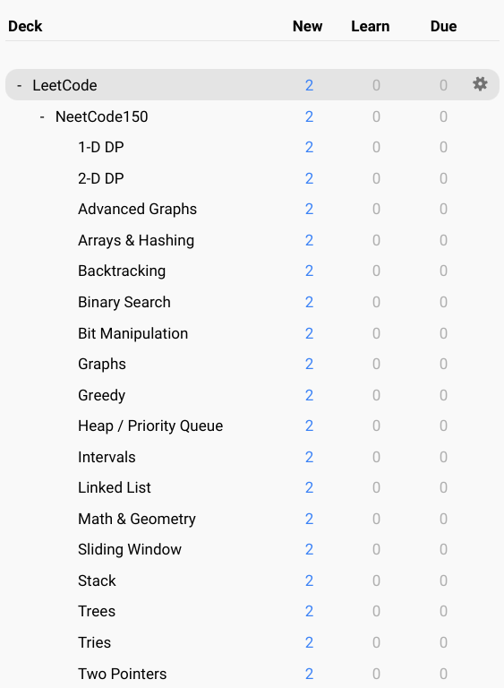

# leetcode-neetcode-anki
[Anki](https://apps.ankiweb.net/) flashcards for the whole set of [LeetCode](https://leetcode.com/) problems + [NeetCode150](https://neetcode.io/) as a subdeck. NeetCode flashcards come in the original order. Scheduling information is also included.

## Card structure
Each card contains the following fields:
* Slug
* Id
* Title
* Topic
* Difficulty
* Paid

which is only a subset of what [[1]](#1) scrapes.

## Deck structure

## Scheduling

## [NeetCode roadmap](https://neetcode.io/roadmap)

## References
<a id="1">[1]</a> The flashcards were generated using https://github.com/fspv/leetcode-anki.
